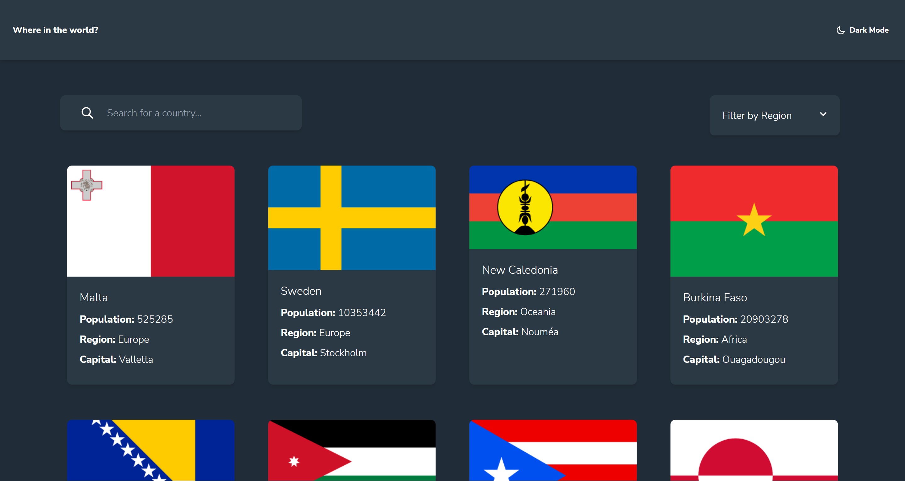

# Frontend Mentor - REST Countries API with color theme switcher solution

This is a solution to the [REST Countries API with color theme switcher challenge on Frontend Mentor](https://www.frontendmentor.io/challenges/rest-countries-api-with-color-theme-switcher-5cacc469fec04111f7b848ca). Frontend Mentor challenges help you improve your coding skills by building realistic projects.

## Table of contents

- [Overview](#overview)
  - [The challenge](#the-challenge)
  - [Screenshot](#screenshot)
  - [Links](#links)
- [My process](#my-process)
  - [Built with](#built-with)
  - [What I learned](#what-i-learned)
  - [Continued development](#continued-development)
  - [Useful resources](#useful-resources)
- [Author](#author)
- [Acknowledgments](#acknowledgments)

## Overview

### The challenge

Users should be able to:

- See all countries from the API on the homepage
- Search for a country using an `input` field
- Filter countries by region
- Click on a country to see more detailed information on a separate page
- Click through to the border countries on the detail page
- Toggle the color scheme between light and dark mode

### Screenshot

### Links

- Solution URL: [uwu](https://github.com/XxtbmfxX/countries-api-frontmentor)
- Live Site URL: [owo](https://vibrant-edison-cc96cf.netlify.app)

## My process

After struggle with filters at the end i could adapt a solution for my problem

### Built with

- Semantic HTML5 markup
- Flexbox
- CSS Grid
- Mobile-first workflow
- [React](https://reactjs.org/) - JS library
- [Taildwind css](https://tailwindcss.com/) - A utility-first CSS framework
- [Headless UI](https://headlessui.dev/) - A PROJECT BY Tailwind Labs
- [Heroicons](https://heroicons.com/) - by the makers of Tailwind CSS.

### What I learned

- Filter and sort data
- Use tailwind icons
- Sometimes the easies solution is the right one

### Continued development

-Learn web3

### Useful resources

-[w3schools](https://www.w3schools.com/Js/)

## Author

- Frontend Mentor - [@XxtbmfxX](https://www.frontendmentor.io/profile/XxtbmfxX)
- Twitter - [@Xx_Toro_xX](https://www.twitter.com/Xx_Toro_xX)

## Acknowledgments

Thanks to:

-PedroThech - [For filters 👌](https://www.youtube.com/watch?v=mZvKPtH9Fzo&t=736s)
-tsbsankara - [For data structure](https://www.youtube.com/watch?v=JKm7kfH7VNU&t=3305s)
